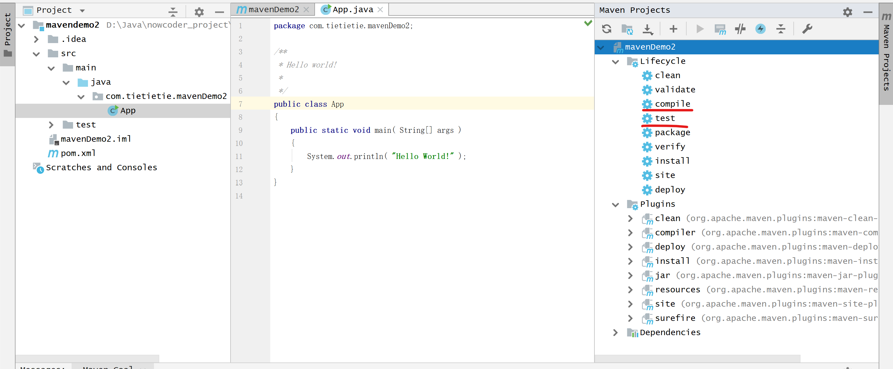

# 初识Spring Boot

## 项目介绍

### 功能介绍

某课网讨论区开发，包括发帖，私信，用户注册，网站流量统计，点赞，关注等功能。

### 技术介绍

Java web的主流框架：Spring（事实上的行业标准）（学习重点）

一般的项目需求，都能在Spring中找到解决方案。

Spring Boot：可以简化Spring框架。

Spring MVC：处理请求

MyBatis：数据库(用Spring整合)

SSM:Spring+Spring MVC+MyBatis.(常用功能都可以实现)

Redis:No-server数据库,内存中数据库,性能好,提高服务性能.

Kafka:消息队列(进行消息发布)

Elasticsearch:流行的搜索引擎

上三者都能提高性能,都可以用Spring整数.

Spring Security, Spring Actuator:安全和系统状态统计.

### 工具介绍

Maven:项目构建

集成开发工具:IntelliJ IDEA

数据库:MySQL+Redis

服务器:Tomcat

版本控制:Git

##  开发环境搭建

注意事项:

1. java --version:>= 8.0
2. 路径名全部为英文且不许有空格.

### Maven

作用:构建项目+**管理jar包**

Maven仓库:

* 本地仓库:存放构件的位置,~/.m2/repository
* 远程仓库:中央仓库,镜像仓库(访问比较快),私服仓库(公司自己用的仓库)
* 本地仓库和远程仓库的联系:现在本地查找,在从远程查找所需要的包.

下载:

binary:不提供源码,zip供Windows使用

初始化一个Maven项目，使用如下命令行：

>  mvn archetype:generate -DgroupId=com.mycompany.app -DartifactId=my-app -DarchetypeArtifactId=maven-archetype-quickstart -DarchetypeVersion=1.4 -DinteractiveMode=false

Dgruopid：为公司名，通常是域名的倒序。

Dartifactid：当前项目的id

Darchetype...：项目模板

Darchetype..：项目版本

还可以设置是否交互，选择否（因为交互模式需要每次确认是/否)

**遇到的问题**

1. 在setting.xml中设置了镜像仓库地址，但是报错不能访问，后改正直接访问中央仓库。
2. 卡在Generating project in Batch mode这一步，参考[这里](https://www.cnblogs.com/wardensky/p/4513372.html)解决。
3. 阅读Maven手册，[5分钟创建Maven](https://maven.apache.org/guides/getting-started/maven-in-five-minutes.html)

编译：mvn compile：编译项目，生成在target文件夹里面的class中

mvn clean：将生成的target文件夹删除。

mvn test：在target中包含了test文件夹，test包含了compile。

### IntelliJ IDEA

#### 在IDEA中连接Maven

1. 找不到build tool里面的maven选项，因为没有安装maven插件。
2. 修改maven工作路径


#### 遇到的问题

- 创建新Maven项目时，无法导入Maven文件，查看log，发现如下错误：


解决办法：因为Maven版本太新，IDEA版本不支持，下载Maven 3.6.1

* IDEA如何清除缓存/项目：

删除缓存：可以现在Maven中搜索“cache...."可以删除缓存

删除项目：现在IDEA中移除项目，然后在对应的文件夹删除，注意**清空回收站**才算完全清除

#### 编译项目

IDEA右侧有Maven快捷命令，可以点击即可。



还可以直接点:build-->build project

也可以直接在对应的.java文件右键，点击run（右键找不到run选项）

#### 快捷健

* 快速查找：按两次shift
* 快速找到接口需要实现的方法：ctrl+I

### Spring Boot

帮助优化Maven管理jar包，因为maven中的包搜索相对麻烦。

#### Maven搜索包

www.mvnrepository.com下载，然后复制对应的语句到pom文件的dependencies位置，Maven会自动下载。

#### Spring Initializer

使用Spring Initializer,可以把某个功能的包一次性下载下来。在start.spring.io中设置相关名称，及添加所需工具包即可。

我选择了Thymeleaf,Spring web,和Spring boot devTools三个依赖（AOP依赖没有找到）

得到一个文件压缩包，解压缩到某一地址，然后用IDEA打开即可。

#### 遇到的问题

* 无法下载插件

因为连接的是国外镜像，无法下载速度慢，需要设置为国内阿里云的镜像，但是会出现连接不上的问题，此时需要在settings-->Maven-->importing-->VM importer options处添加如下代码：

```
-Dmaven.wagon.http.ssl.insecure=true -Dmaven.wagon.http.ssl.allowall=true
```

* 没法显示外部库

没有解决。。

#### 启动程序

Jar包里内置了tomcat，启动可以运行tomcat服务器，默认端口在8080。

#### 特点（核心价值）

1. 起步依赖：starter,帮我们自动添加很多依赖（dependencies）
2. 自动配置：减少很多配置
3. 端点监控：对服务器进行监控。

#### 示例

如何response浏览器发出的请求，在controller下编写对应代码，如下：


在浏览器输入：localhost:8080/alpha/hello，即可返回sayHello()函数的返回值。

#### 修改服务器端口

```
server.port = 15213
server.servlet.context-path = /community
```

在resources的application.properties文件

会发现并不能生效，因为在target文件中也会存在着配置文件，修改那里的配置文件才会生效。

此时在浏览器输入：localhost:15213/community/alpha/hello可访问对应文件（or class)

## Spring入门

多套框架（Spring全家桶），包括：

Spring+Spring Boot+Spring Cloud(将项目拆分为若干个子项目/微服务）+Spring Cloud Data Flow（多种客服端集成数据）

文档手册：Spring.io

### Spring Framework

包括

* Spring core ：IoC
* Spring Data Access
* Web Servlet
* Integration

详细内容点[这里](https://spring.io/projects/spring-framework#overview)

#### Spring IoC

* 控制反转（与常见的[对象关系](https://blog.csdn.net/jiahao1186/article/details/82634723)不同）
* 依赖注入
* IoC容器：一个工厂，管理各种Bean和配置文件（需要提供两种数据，bean对象以及配置文件）（对象之间不会**直接产生关联，降低耦合度**）

More:Bean的详细解释见[这里](https://www.awaimai.com/2596.html)

**遇到的问题**

* 不显示external libraries

搜索文件：projectView.xml，修改其中的“showLibraryContents”为true。

* ctrl+鼠标右键不能进入函数源码

原因：热键冲突

解决办法：在settings-->keymap-->main view --> navigation中找到declaration，发现其快捷键其实是ctrl+alt+鼠标右键。

* 访问目标函数时，需要进行登录

原因：Spring Security在起作用

解决办法：在pom文件中注释掉Security的dependency即可。参考[这里](https://blog.csdn.net/qq_36079461/article/details/96759099)

More：IDEA注释快捷键：ctrl+shift+/

#### 怎样才能被容器扫描

容器会自动创建，但是哪些Bean会被扫描呢？在main函数中，我们传入SpringApplication的其实是一个配置文件：

```java
import org.springframework.boot.SpringApplication;
import org.springframework.boot.autoconfigure.SpringBootApplication;

@SpringBootApplication //这个注解标识的类，其实是一个配置文件，项目启动的时候帮我们配置
public class CommunityApplication {

	public static void main(String[] args) {
		SpringApplication.run(CommunityApplication.class, args);
	}

}
```

其中，SpringBootApplication下存放着配置文件，可以放入IoC容器的Bean，哪些函数（Bean)会被放入IoC文件呢，前面有四种注解的函数，会被扫描：

* @Controller(处理请求)
* @Service（提供服务）
* @Repository(处理数据库)
* @Conponent(通用)

#### 演示IoC

在test中演示，如何获得容器，代码如下：

```java
@SpringBootTest
@ContextConfiguration(classes = CommunityApplication.class)
public class CommunityApplicationTests implements ApplicationContextAware {
    private ApplicationContext applicationContext;

    @Override
    public void setApplicationContext(ApplicationContext applicationContext) throws BeansException {
        this.applicationContext = applicationContext;
    }

    @Test
    public void testApplicationContext() {
        System.out.println(applicationContext);
    }
}
```

* ApplicationContextAware接口可以帮助我们实现容器的传递，在实现了serApplicationContext方法后，我们便可以通过其参数applicationcontext访问容器的
* 将容器的内容打印出来

#### 使用容器降低耦合度（生成bean）

举例：在项目中实现了AlphaDao接口，并且实现了一个类叫做AlphaDaoHibernateImpl，通过注解@repository，它可以被容器扫描并管理，项目中的其他函数调用时，都是基于容器getBean方法，某一天，需要将此接口的技术升级，实现类变成AlphaDaoMyBatisImpl，此时只需要在这个类加上@Primary，即可实现此接口的升级（面向接口）,因为此时向容器中寻找AlphaBao类，默认会给你AlphaDaoMyBatisImpl。

```java
@Repository
@Primary
public class AlphaDaoMyBatisImpl implements AlphaDao {
    @Override
    public String select() {
        return "MyBatis";
    }
}
```

```java
@Test
public void testApplicationContext() {
    System.out.println(applicationContext);
    AlphaDao alphaDao = applicationContext.getBean(AlphaDao.class);
    System.out.println(alphaDao.select());
}
```

如果想要访问特定的bean，则可以通过名字，强制返回指定bean

```java
@Repository("alphaHibernate")
public class AlphaDaoHibernateImpl implements AlphaDao {
    @Override
    public String select() {
        return "Hibernate";
    }
}
```

```java
@Test
public void testApplicationContext() {
    System.out.println(applicationContext);
    AlphaDao alphaDao = applicationContext.getBean(AlphaDao.class);
    System.out.println(alphaDao.select());
    alphaDao = applicationContext.getBean("alphaHibernate", AlphaDao.class);
    System.out.println(alphaDao.select());
}
```

#### 容器管理bean的方法

除了自动构建bean外，还可以初始化bean,以及销毁bean，其中初始化函数是在对象构造函数调用之后，销毁函数是在对象销毁之前，具体如下所示：

```java
@Service
public class AlphaService {
    public AlphaService() {
        System.out.println("实例化AlphaService");
    }

    @PostConstruct
    public void init() {
        System.out.println("初始化AlphaService");
    }

    @PreDestroy
    public void destroy() {
        System.out.println("销毁AlphaService");
    }
}
```

并且默认情况，容器内的bean只会被实例一次（单例模式），如果需要每次调用bean都要实例化，则在对应bean加上注解@Scope("prototype")

#### 容器中装配第三方的bean

配置类+注解（把所有的配置类都放在config包下）

如何装配一个外部bean：使用@Configuration + @Bean， 代码如下所示：

```java
@Configuration  //表明这是一个配置类
public class AlphaConfig {
    @Bean  //这是一个需要装配的bean，bean的名称是“simpleDateFormat”
    public SimpleDateFormat simpleDateFormat() {
        return new SimpleDateFormat("yyyy-MM-dd HH:mm:ss");
    }

}
```

作用：把时间格式统一规定，如果需要输出时间，则调用这个bean即可。

```java
@Test
public void testBeanConfig() {
    SimpleDateFormat simpleDateFormat =
        applicationContext.getBean(SimpleDateFormat.class);
    System.out.println(simpleDateFormat.format(new Date()));
}
```

#### 更简单使用容器的方式

依赖注入（Dependency Injection)

直接声明一个bean类型，然后给他加上注解就可以使用，如果是依赖接口

```java
@Autowired
@Qualifier("alphaHibernate")
private AlphaDao alphaDao;
@Autowired
private AlphaService alphaService;
@Autowired
private SimpleDateFormat simpleDateFormat;

@Test
public void testDI() {
    System.out.println(alphaDao);
    System.out.println(alphaService);
    System.out.println(simpleDateFormat);
}
```

不用我们自己实例化，如果是依赖接口，还能降低耦合度。

#### 综合演示依赖注入

controller调用service，service调用dao，所以在controller中注入service,在service中注入dao。即可实现依赖注入。具体代码如下：

在AlphaController中注入AlphaService

```java
public class AlphaController {

    @Autowired
    private AlphaService alphaService;

    @RequestMapping("/hello")
    @ResponseBody
    public String sayHello() {
        return "Hello, Spring Boot.";
    }

    @RequestMapping("/data")
    @ResponseBody
    public String getData() {
        return alphaService.find();
    }
}
```

在AlphaService注入AlphaDao

```java
public class AlphaService {

    @Autowired
    private AlphaDao alphaDao;

    public AlphaService() {
        System.out.println("实例化AlphaService");
    }

    @PostConstruct
    public void init() {
        System.out.println("初始化AlphaService");
    }

    @PreDestroy
    public void destroy() {
        System.out.println("销毁AlphaService");
    }

    public String find() {
        return alphaDao.select();
    }
}
```


## Spring MVC入门

HTTP的文档：在[这里](https://developer.mozilla.org/zh-CN/docs/Web/HTTP)可以查到相关信息。

右键网页--->检查--->network--->刷新网页：可以发现浏览器与服务器之间有多次信息交流，第一次是请求http，获得了一个html，之后浏览器会根据这个html文件所缺失的信息继续请求内容。

### 三层架构

服务器的三层结构：表现层/业务层/数据层

MVC的三层结构（在表现层）：控制层（controller）+模型层（Model）+视图层（View）

核心组件：DispatherServlet（前端控制器/一个类）调度MVC三个层


上图表示Spring MVC是如何处理服务器发来的请求的。

### 模板引擎

作用：生成动态HTML

需要：模板文件+model数据

特点：自然模板，以HTML文件为模板（便于交流）

语法：常用表达式/判断循环/模板布局

手册看[这里](https://www.thymeleaf.org/doc/tutorials/3.0/usingthymeleaf.html)

### 举例

* 如何查看项目的常用配置

查看[这里](https://docs.spring.io/spring-boot/docs/2.2.6.RELEASE/reference/htmlsingle/#common-application-properties)可以找到相应的配置类，配置文件通过给配置类赋值，来改变相应配置。

* 使用HttpServletRequest和HttpServletResponse来获得服务器请求，以及向服务器传输数据

代码：

```java
@RequestMapping("/http")
public void http(HttpServletRequest request, HttpServletResponse response) {
    //输出请求信息（在服务器控制台）
    System.out.println(request.getMethod());
    System.out.println(request.getServletPath());
    Enumeration<String> enumeration = request.getHeaderNames();
    while (enumeration.hasMoreElements()) {
        String name = enumeration.nextElement();
        String value = request.getHeader(name);
        System.out.println(name + " : " + value);
    }

    //通过向response写数据，从而向服务器输出
    response.setContentType("text/html;charset=utf-8");
    try (PrintWriter writer = response.getWriter();) {
        writer.write("<h1>ZT的牛客网<h1>");
    } catch (IOException e) {
        e.printStackTrace();
    }
}
```

Spring还提供了更简单的处理方式：直接用注解，返回Responsebody下面函数的返回值

### 如何获得浏览器传来的参数

* @Requestmapping()可以指定请求的方法（默认get），以及路径
* 在传入参数中添加注解，可以设置浏览器传来参数的名称，默认是否必须，默认值（处理传入参数很容易）

```java
    @RequestMapping(path = "/students", method = RequestMethod.GET)
    @ResponseBody
    public String getStudents(
            @RequestParam(name = "current", required = false, defaultValue = "1") int current,
            @RequestParam(name = "limit", required = false, defaultValue = "10") int limit) {
        System.out.println(current);
        System.out.println(limit);
        return "Some Students";
    }
```

参数也可以是路径的一部分，添加注解即可，如下所示

```java
@RequestMapping(path = "/student/{id}", method = RequestMethod.GET)
@ResponseBody
public String getStudent(@PathVariable("id") int id) {
return "a student : " + id;
}
```

### Post

post是指网页向服务器发送数据，在static中创建一个静态网页,设置了action后,点击submit,即可向对应path的函数传参

为什么不用get传数据呢?因为get请求会使用url传输参数,长度有限

静态网页如下

```html
<!DOCTYPE html>
<html lang="en">
<head>
    <meta charset="UTF-8">
    <title>增加学生</title>
</head>
<body>

<form method="post" action="/community/alpha/student">
    <p>
        姓名：<input type="text" name="name">
    </p>
    <p>
        年龄：<input type="text" name="age">
    </p>
    <p>
        <input type="submit" name="保存">
    </p>
</form>

</body>
</html>
```

响应函数如下(可以加注解):

```java
//post请求
@RequestMapping(path = "/student", method = RequestMethod.POST)
@ResponseBody
public String saveStudent(String name, int age) {
    System.out.println(name);
    System.out.println(age);
    return "success";
}
```

### 如何响应数据(response)

#### 返回网页方法一

```java
//响应html数据
@RequestMapping(path = "/teacher", method = RequestMethod.GET)
public ModelAndView gerTeacher() {
    ModelAndView modelAndView = new ModelAndView();
    modelAndView.addObject("name", "张铁");
    modelAndView.addObject("age", "24");
    modelAndView.setViewName("/demo/view");
    return modelAndView;
}
```

设置普通html为模板,以及填充传入参数的方法:(注意thymeleaf(th)的语法)

```html
<!DOCTYPE html>
<html lang="en" xmlns:th="http://thymeleaf.org">
<head>
    <meta charset="UTF-8">
    <title>Teacher</title>
</head>
<body>
<p th:text="${name}"></p>
<p th:text="${age}"></p>
</body>
</html>
```

#### 返回网页方法二

model和view分开,view以字符串形式返回

```java
//查询学校
@RequestMapping(path = "/school", method = RequestMethod.GET)
public String getSchool(Model model) {
    model.addAttribute("name", "HUST");
    model.addAttribute("age", 100);
    return "/demo/view";
}
```

#### 响应json数据

在异步请求中(没有刷新页面,但是悄悄地访问了服务器一次)(所以这次服务器返回结果不是html)

json数据:把java对象返回给浏览器时,由于浏览器是JS对象,所以需要使用json,起到现阶对象.

Json字符串:跨语言地常用工具

```java
@RequestMapping(path = "/emp", method = RequestMethod.GET)
@ResponseBody
public Map<String, Object> getEmp() {
    Map<String, Object> emp = new HashMap<>();
    emp.put("name", "zhangtie");
    emp.put("age", 23);
    emp.put("salary", 20000);
    return emp;
}
```

返回结果如下

```
{"name":"zhangtie","salary":20000,"age":23}
```

也可以返回集合,json字符串也能表示

```java
@RequestMapping(path = "/emps", method = RequestMethod.GET)
@ResponseBody
public List<Map<String, Object>> getEmps() {
    Map<String, Object> emp = new HashMap<>();
    List<Map<String, Object>> list = new ArrayList<>();
    emp.put("name", "zhangtie");
    emp.put("age", 23);
    emp.put("salary", 20000);
    list.add(emp);
    emp = new HashMap<>();
    emp.put("name", "lisi");
    emp.put("age", "22");
    list.add(emp);
    emp = new HashMap<>();
    emp.put("name", "wangwu");
    emp.put("age", "23");
    list.add(emp);
    return list;
}
```

返回结果如下:

```
[{"name":"zhangtie","salary":20000,"age":23},{"name":"lisi","age":"22"},{"name":"wangwu","age":"23"}]
```

## MyBatis入门

### 安装MySQL

初始化MySQL，就算有环境变量，也要cd到bin目录下

按照以下步骤初始化

```
mysqld --initialized --console
mysqld install
net start mysql
```

### MyBatis

学习手册分别为:[这里](https://mybatis.org/mybatis-3/zh/index.html)和[这里](http://mybatis.org/spring/zh/index.html)

* 核心组件

SqlSessionFactory/SqlSession/XML配置文件:Spring已经整合帮我们初始化了.

Mapper:DAO接口

Mapper映射器:对应sql和实体类映射

#### 举例

对user表进行CRUD(增删改查)

导入jar包,(mybatis,mysql)

在application.properties中配置mysql

* 在jar包entity中定义查询sql返回类型(为User)
* 在DAO中声明接口（UserMapper）
* 在resourses中的mapper中定义配置文件(映射文件),使得UserMapper中定义的接口函数与sql操作一一对应

如何便于debug：

在日志中打印出具体执行的sql，在设置中添加如下代码

```
#logger
logging.level.com.nowcoder.community=debug
```

## 开发社区首页

* 先开发DAO再开发Service再开发Controller
* 功能拆解：