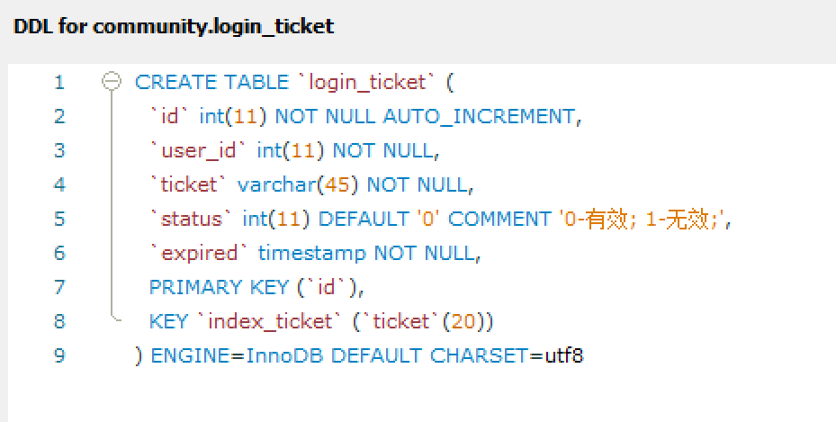

# 第二章：开发社区的登录模块

## 发送邮件

目的：服务器向用户发送邮件

### 邮箱设置

* 申请了一个新浪邮箱，设置STMP服务开启。
* 安装Spring mail的jar包
* 配置邮箱

```
#MailProperties
spring.mail.host=smtp.sina.com
spring.mail.port=465
spring.mail.username=nowcoderzt@sina.com
spring.mail.password=0dba281fa3487473
spring.mail.protocol=smtps
spring.mail.properties.mail.smtp.ssl.enable=true
```

* 创建一个MailSender类

```java
@Component
public class MailClient {
    private static final Logger logger = LoggerFactory.getLogger(MailClient.class);

    @Autowired
    private JavaMailSender mailSender;

    @Value("${spring.mail.username}")
    private String from;

    public void sendMail(String to, String subject, String context) {

        try {
            MimeMessage message = mailSender.createMimeMessage();
            MimeMessageHelper helper = new MimeMessageHelper(message);
            helper.setFrom(from);
            helper.setTo(to);
            helper.setSubject(subject);
            helper.setText(context, true);
            mailSender.send(helper.getMimeMessage());
        } catch (MessagingException e) {
            logger.error("发送邮件失败" + e.getMessage());
        }
    }
}
```

测试邮件发送成功

### Spring Email

### 模板引擎

发送的是Html格式的邮件

在测试类中，需要我们主动调用模板引擎，注入相应bean即可，代码如下：

```java
    @Test
    public void testHtmlMail() {
        Context context = new Context();
        context.setVariable("username", "sunday");
        String content = templateEngine.process("/mail/demo", context);
        System.out.println(content);
        mailClient.sendMail("zhangtiezhangtie@outlook.com", "HTML", content);
    }
```

其中，需要指定模板文件的地址，及模板所需要的参数，模板引擎会自动生成网页（一个字符串content），把这个字符串使用mailClient发送即可。

## 开发注册功能

web项目：按照请求拆解功能，比如注册功能：

1，打开注册网页

2，把注册的信息发送给服务器（点注册）

3，把激活邮件发送给邮箱

4，利用激活链接打开网页

每一次请求都是先开发数据访问层，在开发业务层，最后开发视图层（三层架构），但是每一次请求不一定要用到这三层

### 打开注册页面

* 使用thymeleaf实现一段标签的复用

把index的顶部标签复用给register.html，部分代码如下：

````html
//在Index的header部分添加th代码
<div class="nk-container">
    <!-- 头部 -->
    <header class="bg-dark sticky-top" th:fragment="header">
//在register部分添加如下th代码
<div class="nk-container">
    <!-- 头部 -->
    <header class="bg-dark sticky-top" th:replace="index::header">
````

注意th的变量需要用@{}括起来，不然会报错

### 提交注册数据

首先导入“判断字符串/集合空值”的包

把我们网站的链接做成可配置的。在properties中设置网站域名（本机）

写两个工具，可以生成随机字符串，以及加密工具。

写一个service类，帮助我们把传来的用户数据存到数据库里面，具体包括：用户查重，加密密码，发送用户激活码，代码如下：

```java
public class UserService {
    @Autowired
    private UserMapper userMapper;

    @Autowired
    private MailClient mailClient;

    @Autowired
    private TemplateEngine templateEngine;

    @Value("${community.path.domain}")
    private String domain;

    @Value("${server.servlet.context-path}")
    private String contextPath;

    public User findUserById(int id) {
        return userMapper.selectById(id);
    }

    public Map<String, Object> register(User user) {
        Map<String, Object> map = new HashMap<>();
        //空值处理
        if (user == null) {
            throw new IllegalArgumentException("参数不能为空，谢谢");
        }
        if (StringUtils.isBlank(user.getUsername())) {
            map.put("usernameMsg", "账号不能为空");
            return map;
        }
        if (StringUtils.isBlank(user.getPassword())) {
            map.put("passwordMsg", "密码不能为空");
            return map;
        }
        if (StringUtils.isBlank(user.getEmail())) {
            map.put("emailMsg", "邮箱不能为空");
            return map;
        }
        //验证账号
        User findUser = userMapper.selectByName(user.getUsername());
        if (findUser != null) {
            map.put("usernameMsg", "该账号已存在");
            return map;
        }
        //验证邮箱
        findUser = userMapper.selectByEmail(user.getEmail());
        if (findUser != null) {
            map.put("emailMsg", "该邮箱已存在");
            return map;
        }
        //注册用户
        user.setSalt(CommunityUtil.generateUUID().substring(0, 5));
        user.setPassword(CommunityUtil.md5(user.getPassword() + user.getSalt()));
        user.setType(0);
        user.setStatus(0);
        user.setActivationCode(CommunityUtil.generateUUID());
        user.setHeaderUrl(String.format("http://images.nowcoder.com/head/%dt.png", new Random().nextInt(1000)));
        user.setCreatTime(new Date());
        userMapper.insertUser(user);

        //发送激活邮件
        Context context = new Context();
        context.setVariable("email", user.getEmail());
        //http://localhost:15213/communityactivation/101/code
        String url = domain + contextPath + "/activation" + user.getId() + "/" + user.getActivationCode();
        context.setVariable("url", url);
        String content = templateEngine.process("/mail/activation", context);
        mailClient.sendMail(user.getEmail(), "激活账号", content);
    }
}
```

写一个controller类，来进行前后端交互

* 注册工程后，页面跳转到首页（第三方页面：operate-result.html，显示页面在多少秒后跳转（转到首页））
* 在修改html时，需要给表单中的每一个获得的变量（账号名/邮箱等），指定参数名，和user中的参数名一一对应，这样spring mvc可以自动的创建user
* 回到错误页面，需要把这些错误信息还在register中显示，使用th:value = "@{//判断user是否为null}"

终于收到了激活邮箱。。


### 激活账号

有多种情况：

* 成功激活（第一次）
* 重复激活
* 无效的激活链接


## 会话管理

### 定义

http是无状态且有会话的。

无状态：请求之间是没有联系的（无差别对待）（用户没有办法进行连续的交互）（服务器无法记住浏览器的状态）

如何解决业务之间的联系：使用cookies来解决无状态，形成整体。

所以有会话是指：使得服务器和浏览器之间能有连续的交互。使得服务器能够**记住**浏览器。

cookies：由服务器发送给浏览器（在响应头），表明其身份，浏览器保存到本地，下次浏览器携带着cookies再次访问服务器时（在请求头），服务器能够**认识**这个浏览器。所以cookies是一个特殊的数据.(很小的数据，只有一对key:value)（能够得到浏览器的一些特征数据）


### 演示cookies

为访问此路径的浏览器生成cookie并放在response中，代码如下：

```java
    //cookies演示
    @RequestMapping(path = "cookie/set", method = RequestMethod.GET)
    @ResponseBody
    public String setCookie(HttpServletResponse response) {
        //创建cookie
        Cookie cookie = new Cookie("code", CommunityUtil.generateUUID());
        //设置cookie的生效范围（只有在哪些路径有效）
        cookie.setPath("/community/alpha");
        //设置cookie的生存时间（因为默认是存在内存里的，关掉浏览器就没了）(单位是秒）
        cookie.setMaxAge(60 * 10);
        response.addCookie(cookie);
        return "set cookie";
    }
```

如何使用浏览器发来的cookie，如下：

```java
    @RequestMapping(path = "cookie/get", method = RequestMethod.GET)
    @ResponseBody
    public String getCookie(@CookieValue("code") String code) {
        System.out.println(code);
        return "get cookie";
    }
```

优点：弥补http的无状态

缺点：

* 不安全，因为不知道浏览器所在系统的安全性
* 对流量/性能有影响

### 演示Session

另一种解决办法：session

* 用于在服务端的存储在客服端信息，优点是安全，缺点是造成了服务器的压力。
* 与cookie是有关系的

1，浏览器访问服务器，服务器创建一个对应的session对象，session依赖于cookie，自动创建了sessionID放在cookie中，发送给服务器

2，浏览器把存的cookie的sessionID，在下次请求中发送给服务器，从而服务器可以通过这个sessionID，找到与此浏览器对应的session对象

演示如何创建session，传入数据

```java
    //session示例
    @RequestMapping(path = "session/set", method = RequestMethod.GET)
    @ResponseBody
    public String setSession(HttpSession session) {
        //SpringMVC会自动地注入，只需要声明即可
        session.setAttribute("id", 1);
        session.setAttribute("name", "test");
        return "set session";
    }
```


服务端获得对应地seesion参数值以及sessionID

```java
    @RequestMapping(path = "session/get", method = RequestMethod.GET)
    @ResponseBody
    public String getSession(HttpSession session) {
        System.out.println(session.getId());
        System.out.println(session.getAttribute("name"));
        return "get session";
    }
```

所以session也能解决会话问题。

Q&A

* 在分布式部署中，为什么不使用session呢？

因为服务器是分布式部署的（承载大流量），浏览器访问的是服务器代替nginx，nginx按照负载均衡的原则分配请求。在多次请求的过程中，可能会有多台服务器处理同一个浏览器的请求，但session只保存在一台服务器中。

解决策略：

粘性session：浏览器只访问一个服务器。（负载不均衡）

同步session：每个服务器存的session都相同（性能降低，增大服务器的耦合性）

共享session：单独有一台服务器来存储session，当服务器需要使用session时，往这台服务器申请（这台服务器威胁到了整个集群）

常用解决方案：一般数据都使用cookie而不是session，必要重要的数据存到数据库（集群）（非关系型数据库redis）里。

## 生成验证码

使用现成工具：kaptcha，在服务端内存中画出验证码，发送给浏览器。

1. 导入kaptcha的jar包
2. 编写Kaptcha的配置类
3. 生成随机字符，生成图片

配置Kaptcha如下：

```java
@Configuration
public class KaptchaConfig {
    @Bean
    public Producer kaptchaProducer() {
        Properties properties = new Properties();
        properties.setProperty("kaptcha.image.width", "100");
        properties.setProperty("kaptcha.image.height", "40");
        properties.setProperty("kaptcha.textproducer.font.size", "32");
        properties.setProperty("kaptcha.textproducer.font.color", "0,0,0");
        properties.setProperty("kaptcha.textproducer.char.string", "1234567890qwertyuiopsdfghklzxcnvbm");
        properties.setProperty("kaptcha.textproducer.char.length", "4");
        properties.setProperty("kaptcha.noise,impl", "com.google.code.kaptcha.impl.NoNoise");
        DefaultKaptcha kaptcha = new DefaultKaptcha();
        Config config = new Config(properties);
        kaptcha.setConfig(config);
        return kaptcha;
    }
```

生成验证码，如下：

```java
@RequestMapping(path = "/kaptcha", method = RequestMethod.GET)
    public void getKaptcha(HttpServletResponse response, HttpSession session) {
        //生成验证码
        String text = kaptchaProducer.createText();
        BufferedImage image = kaptchaProducer.createImage(text);

        //保存验证码到session
        session.setAttribute("kaptcha", text);

        //将图片输出到浏览器
        response.setContentType("image/png");

        try {
            OutputStream os = response.getOutputStream();
            ImageIO.write(image, "png", os);
        } catch (IOException e) {
            logger.error("响应验证码失败" + e.getMessage());
        }
```

login.html修改如下：

```html
<div class="col-sm-4">
    
    <a href="javascript:refresh_kaptcha();" class="font-size-12 align-bottom">刷新验证码</a>
</div>
```

```javascript
function refresh_kaptcha(){
    var path = "/community/kaptcha?p=" + Math.random();
    $("#kaptcha").attr("src",path);
}
```

## 开发登录/退出功能

包含有如下业务：

* 登录
  * 验证账号，密码，验证码
  * 登录成功，生成登录凭证，发送给客户端
  * 登录失败，跳转到登录页
* 退出
  * 将登录凭证修改为失效
  * 跳转至网站首页

登录凭证：一个key，包含有敏感数据，存在数据库（后面会存在redies），数据结构如下：



### 实现数据层

可以用注解来实现LoginTicketMapper接口（与之前在Mapper中写配置文件不同）

好处：方便，坏处：难以阅读，不够整洁

### 实现业务层

包括对用户名/密码的判断，已经验证是否存在该user，如果存在，需要返回一个唯一的ticket。

```java
    public Map<String, Object> login(String username, String password, int expiredSeconds) {
        Map<String, Object> map = new HashMap<>();

        //空值判断
        if (StringUtils.isBlank(username)) {
            map.put("usernameMsg", "账号不能为空");
            return map;
        }
        if (StringUtils.isBlank(password)) {
            map.put("passwordMsg", "密码不能为空");
            return map;
        }

        //验证账号
        User user = userMapper.selectByName(username);
        if (user == null) {
            map.put("usernameMsg", "账号不存在");
            return map;
        }
        if (user.getStatus() == 0) {
            map.put("usernameMsg", "账号还没有激活");
            return map;
        }

        //验证密码
        password = CommunityUtil.md5(password + user.getSalt());
        if (!password.equals(user.getPassword())) {
            map.put("passwordMsg", "密码错误");
            return map;
        }
        //生成登录凭证
        LoginTicket loginTicket = new LoginTicket();
        loginTicket.setUserId(user.getId());
        loginTicket.setTicket(CommunityUtil.generateUUID());
        loginTicket.setStatus(0);
        loginTicket.setExpired(new Date(System.currentTimeMillis() + expiredSeconds * 1000));
        loginTicketMapper.insertLoginTicket(loginTicket);
        map.put("ticket", loginTicket.getTicket());
        return map;
    }
```

### 实现处理层

注意进行post请求后，当服务器返回错误的username给login页面时，需要获得该错误的username，显示在网页上, 如何获得该username呢？可以直接在request中取值（因为username是在request中的），使用param.username，可在request中取值。

```java
    @RequestMapping(path = "/login", method = RequestMethod.POST)
    public String login(String username, String password, String code, boolean rememberMe,
                        Model model, HttpSession session, HttpServletResponse response) {

        //检查验证码
        String kaptcha = (String) session.getAttribute("kaptcha");
        if (StringUtils.isBlank(kaptcha) || StringUtils.isBlank(code) || !kaptcha.equalsIgnoreCase(code)) {
            model.addAttribute("codeMsg", "验证码错误");
            return "/site/login";
        }

        //检查账号密码
        int expiredSeconds = rememberMe ? REMEMBER_EXPIRED_SECONDS : DEFALUT_EXPIRED_SECONDS;
        Map<String, Object> map = userService.login(username, password, expiredSeconds);
        if (map.containsKey("ticket")) {
            Cookie cookie = new Cookie("ticket", (String) map.get("ticket"));
            cookie.setPath(contextPath);
            cookie.setMaxAge(expiredSeconds);
            response.addCookie(cookie);
            return "redirect:/index";
        } else {
            model.addAttribute("usernameMsg", map.get("usernameMsg"));
            model.addAttribute("passwordMsg", map.get("passwordMsg"));
            return "/site/login";
        }
    }

    @RequestMapping(path = "/logout", method = RequestMethod.GET)
    public String logout(@CookieValue("ticket") String ticket) {
        userService.logout(ticket);
        //默认get请求
        return "redirect:/login";
    }
```

注意在index.html中把退出登录按钮的链接配置好。

## 显示登录信息

* 根据登录与否，显示登录信息
* 登录信息在头部，每一个页面都需要显示信息

拦截器：拦截请求，然后在请求中添加代码，能以很低的耦合度，解决通用问题。

### 拦截器示例

* 实现拦截器的接口
* 配置拦截器：指定拦截哪些请求

拦截器与controller没有直接关系，耦合度很低。

```java
@Component
public class Alphainteceptor implements HandlerInterceptor {

    private static final Logger logger = LoggerFactory.getLogger(Alphainteceptor.class);

    //在controller之前执行
    //返回false，表示controller不往下执行
    @Override
    public boolean preHandle(HttpServletRequest request, HttpServletResponse response, Object handler) {
        logger.debug("preHandler: " + handler.toString());
        return true;
    }

    //调用完controller之后执行
    @Override
    public void postHandle(HttpServletRequest request, HttpServletResponse response, Object handler, ModelAndView modelAndView) {
        logger.debug("postHander:" + handler.toString());
    }

    //在模板引擎执行完之后执行
    @Override
    public void afterCompletion(HttpServletRequest request, HttpServletResponse response, Object handler, Exception ex) {
        logger.debug("afterCompletion : " + handler.toString());
    }
}
```

实现了拦截器的类之后，还需要对这个拦截器进行进行配置，代码如下：

```java
@Configuration
public class WebMvcConfig implements WebMvcConfigurer {
    @Autowired
    private Alphainteceptor alphainteceptor;

    @Override
    public void addInterceptors(InterceptorRegistry registry) {
        registry.addInterceptor(alphainteceptor)
                .excludePathPatterns("/**/*.css", "/**/*.js", "/**/*.png", "/**/*.jpg", "/**/*.jpeg")
                .addPathPatterns("/register", "/login");
        
    }
}
```

### 拦截器应用

包括以下步骤：

1. 在请求之前先查到登录用户
2. 在本次请求中持有用户数据
3. 在模板视图上显示用户数据
4. 在请求结束时清理用户数据

浏览器存着ticket放在cookie中，每次访问服务器，都会把这个ticket发送给服务器，从而得到当前用户是谁（login_ticket），得到user后，把它放在model中，最终html中则显示了用户信息。

把user信息放在ThreadLocal中，这样在整个请求过程中，user都一直存在，并能被访问。

实现拦截器：

```java
@Component
public class LoginTicketiterceptor implements HandlerInterceptor {

    @Autowired
    private UserService userService;
    @Autowired
    private HostHolder hostHolder;

    @Override
    public boolean preHandle(HttpServletRequest request, HttpServletResponse response, Object handler) {
        //从cookie中获取ticket
        String ticket = CookieUtil.getValue(request, "ticket");
        if (ticket != null) {
            LoginTicket loginTicket = userService.findLoginTicket(ticket);
            if (loginTicket != null && loginTicket.getStatus() == 0 && loginTicket.getExpired().after(new Date())) {
                User user = userService.findUserById(loginTicket.getUserId());
                //在本此请求中持有用户，考虑多线程并发，多线程隔离
                hostHolder.setUser(user);
            }
        }
        return true;
    }

    @Override
    public void postHandle(HttpServletRequest request, HttpServletResponse response, Object handler, ModelAndView modelAndView) {
        User user = hostHolder.getUser();
        if (user != null && modelAndView != null) {
            modelAndView.addObject("loginUser", user);
        }
    }

    @Override
    public void afterCompletion(HttpServletRequest request, HttpServletResponse response, Object handler, Exception ex) {
        hostHolder.clear();
    }
}
```

实现HostHolder

```java
//持有用户信息，用于代替session对象，协程隔离
@Component
public class HostHolder {
    private ThreadLocal<User> users = new ThreadLocal<>();

    public void setUser(User user) {
        users.set(user);
    }

    public User getUser() {
        return users.get();
    }

    public void clear() {
        users.remove();
    }
}
```

配置拦截器

```java
@Configuration
public class WebMvcConfig implements WebMvcConfigurer {
    @Autowired
    private Alphainteceptor alphainteceptor;
    @Autowired
    private LoginTicketiterceptor loginTicketiterceptor;

    @Override
    public void addInterceptors(InterceptorRegistry registry) {
        registry.addInterceptor(alphainteceptor)
                .excludePathPatterns("/**/*.css", "/**/*.js", "/**/*.png", "/**/*.jpg", "/**/*.jpeg")
                .addPathPatterns("/register", "/login");

        registry.addInterceptor(loginTicketiterceptor)
                .excludePathPatterns("/**/*.css", "/**/*.js", "/**/*.png", "/**/*.jpg", "/**/*.jpeg");
    }
}
```

## 账号设置

开发步骤：

1. 访问账号设置页面
2. 上传头像（存在服务器上）
3. 获取图像（页面能够在服务器上获取头像）

### 访问账号设置页面

新建UserController，并处理/user/setting的get方法，返回账号设置页面模板。

修改Index中的header，将对应账号设置按钮，设置相应路径，实现跳转。